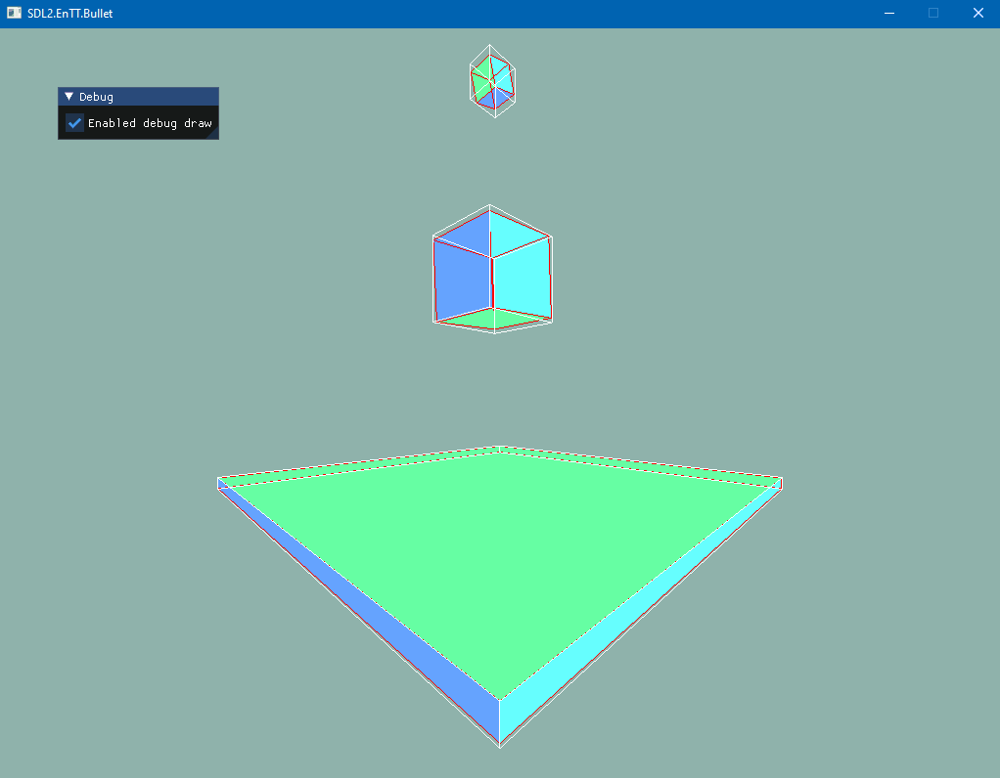

# sdl2-entt-bullet-imgui

SDL2 project using IMGUI, EnTT and Bullet Physics with the latest OpenGL.

This project makes use of the following libraries/projects:

* [SDL2](https://www.libsdl.org/)
* [IMGUI](https://github.com/ocornut/imgui/)
* [GLM](https://github.com/g-truc/glm/)
* [CPM](https://github.com/cpm-cmake/CPM.cmake)
* [GLAD](https://glad.dav1d.de/)
* [EnTT](https://github.com/skypjack/entt/)
* [BULLET3](https://github.com/bulletphysics/bullet3/)

Using this project with ``dotcpp`` is a single line command:

```
dotcpp new sdl2-entt-bullet-imgui --output ./sdl2-entt-bullet-imgui
```


